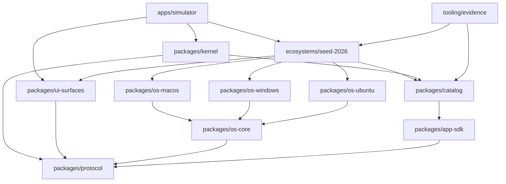
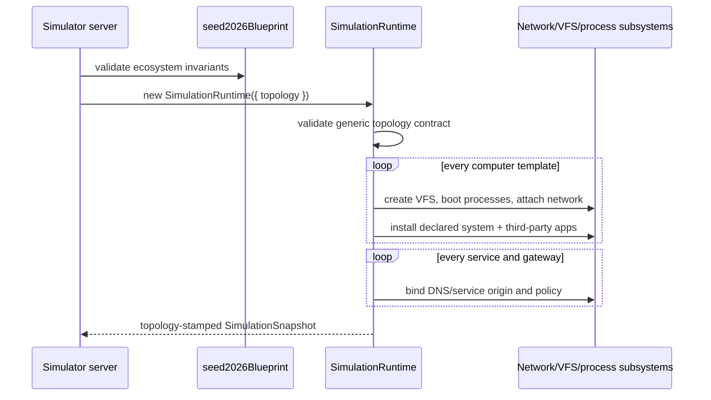
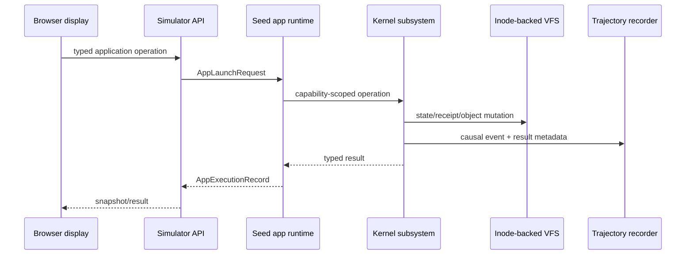
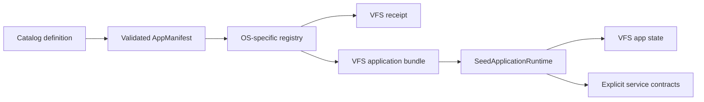

# Seed computer ecosystem architecture

## Design rule

The repository is organized by authority, not by file type. A lower layer owns a contract or mechanism; a higher layer may compose it but may not redefine it. The architecture checker rejects undeclared internal imports, disallowed layer edges, cross-package relative imports, dependency cycles, and TypeScript workspaces without build/typecheck tasks.



No package below the application layer imports React, browser code, presentation code, or evidence artifacts.

## Workspace map

| Workspace | Authority | May depend on |
|---|---|---|
| `@seed/protocol` | Serializable types crossing package, process, display, and evidence boundaries | Nothing internal |
| `@seed/app-sdk` | Application manifest construction, operation profiles, launch requests, package descriptors | Protocol |
| `@seed/os-core` | OS-profile schema and invariants | Protocol |
| `@seed/os-macos` | macOS 26 kernel, shell, paths, boot services, drivers, package managers, system apps | OS core, protocol |
| `@seed/os-windows` | Windows 11 26H2 profile | OS core, protocol |
| `@seed/os-ubuntu` | Ubuntu 26.04 profile | OS core, protocol |
| `@seed/catalog` | System and ecosystem application definitions and backend service contracts | App SDK, protocol |
| `@seed/kernel` | VFS, processes, shell, network, packages, Git, app execution, trajectory | Catalog, protocol |
| `@seed/ui-surfaces` | Product-specific information architecture, interactions, state sources, platform adapters | Protocol |
| `@seed/ecosystem-seed-2026` | Concrete computers, installed-app sets, services, DNS, gateways, fidelity invariants | Catalog, OS profiles, surfaces, protocol |
| `@seed/simulator` | Single-process server and browser displays | Ecosystem and runtime layers |
| `@seed/chatgpt-workspace` | Independently deployable full-stack ChatGPT application | No simulator internals |
| `@seed/tooling-evidence` | The validated 48-scene evidence matrix | Ecosystem, catalog |
| `@seed/tooling-architecture` | Boundary validation and graph generation | Node standard library only |

## Runtime authority

The browser is a projection and input device. It does not own simulated files, messages, processes, packages, repositories, or packets.

The executable topology has the same inversion boundary. `@seed/kernel` accepts a generic, serializable `SimulationTopology`; it does not import the seed ecosystem. The simulator selects `seed2026Blueprint`, validates it, and passes it into the runtime. Computer specs, exact system/third-party app inventories, service placement, DNS endpoints, and gateway policies are therefore initialized from one contract rather than duplicated as runtime defaults.





An application interaction is high-fidelity only when its visible result is derived from the same state that shell commands and APIs inspect. Local UI state is acceptable for transient selection, focus, hover, draft, and animation state; durable domain state belongs in the runtime.

## Operating-system profiles

An OS profile is not a theme token bundle. It declares:

- kernel family, version, init, and service manager;
- desktop shell, window manager, compositor, display server, launcher, and settings surface;
- shell executable, dialect, and startup files;
- filesystem roots, path semantics, case sensitivity, and native formats;
- native/language package managers and receipt roots;
- boot-service parentage and role;
- peripheral drivers and hot-plug behavior;
- the system-application set and platform conventions.

The ecosystem validator verifies that every system-app ID exists in the catalog, is marked as a system application, and supports that profile’s OS.

## Application definition and execution

`@seed/catalog` is split into system and ecosystem definitions. Every definition passes through `defineApplication` from `@seed/app-sdk`, which supplies a runtime descriptor and a user-observable operation profile, then validates IDs, entrypoints, OS support, duplicate operations, and required service contracts.



Applications do not receive ambient host access. Host execution is a separate default-deny gateway with computer, app, executable, working-directory, time, and output limits.

## Service isolation

Service contracts belong to the application definition. For example, Slack and Teams are independent collaboration planes:

| Product | Host | Isolation domain | Client operation |
|---|---|---|---|
| Slack | `slack.seed.local` | `slack` | Poll/post Slack channels |
| Microsoft Teams | `teams.seed.local` | `teams` | Poll/post Teams channels |

There is no implicit product bridge. A future bridge would require its own service, authorization policy, storage, packet trace, and trajectory events.

## UI surface contracts

`@seed/ui-surfaces` maps every catalog application to exactly one surface definition. A surface specifies its information regions, functional interactions, authoritative state sources, supported platform adapters, and a product-identity rule. Coverage validation rejects missing, duplicate, unknown, or unsupported mappings.

This keeps code sharing honest: applications may share a lower-level primitive such as a list, editor, canvas, or media transport without sharing an inappropriate product information architecture.

## Evidence as a build input

`@seed/tooling-evidence` owns a validated 48-scene matrix: sixteen workflows for each display computer. Every scene names the computer, applications, user-visible workflow, and causal assertion. Validation checks scene uniqueness, exact cardinality, computer existence, application existence, OS compatibility, and membership in that computer’s actual topology-installed app set before a capture starts. Merely cataloging a supported app is insufficient evidence.

## Commands

```bash
pnpm check:boundaries   # internal dependency graph and import rules
pnpm architecture       # emit the current Mermaid dependency graph
pnpm typecheck          # Turborepo typecheck across every workspace
pnpm test               # kernel vertical integration suite
pnpm build              # simulator plus transitive workspace dependencies
pnpm build:all          # every deployable app and package
```

Turborepo hashes workspace source, lockfile state, package tasks, and dependency outputs. It does not replace TypeScript project references; Turbo schedules packages while TypeScript verifies their contracts.
