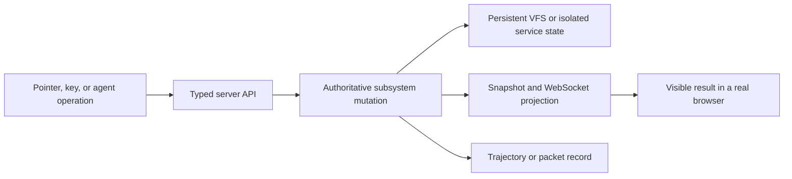
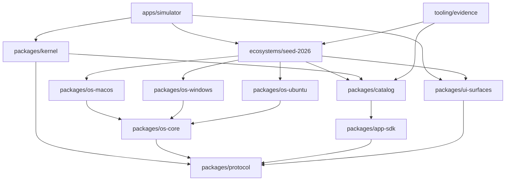
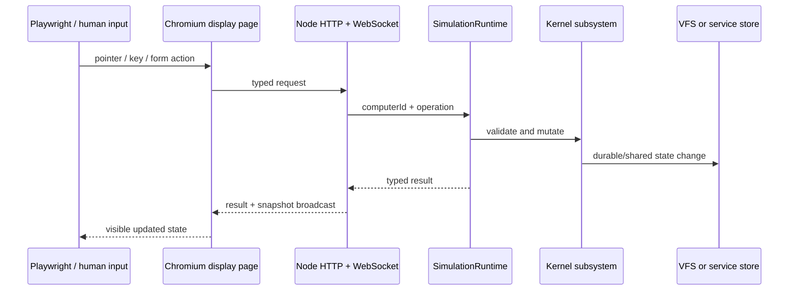
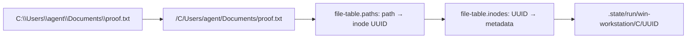
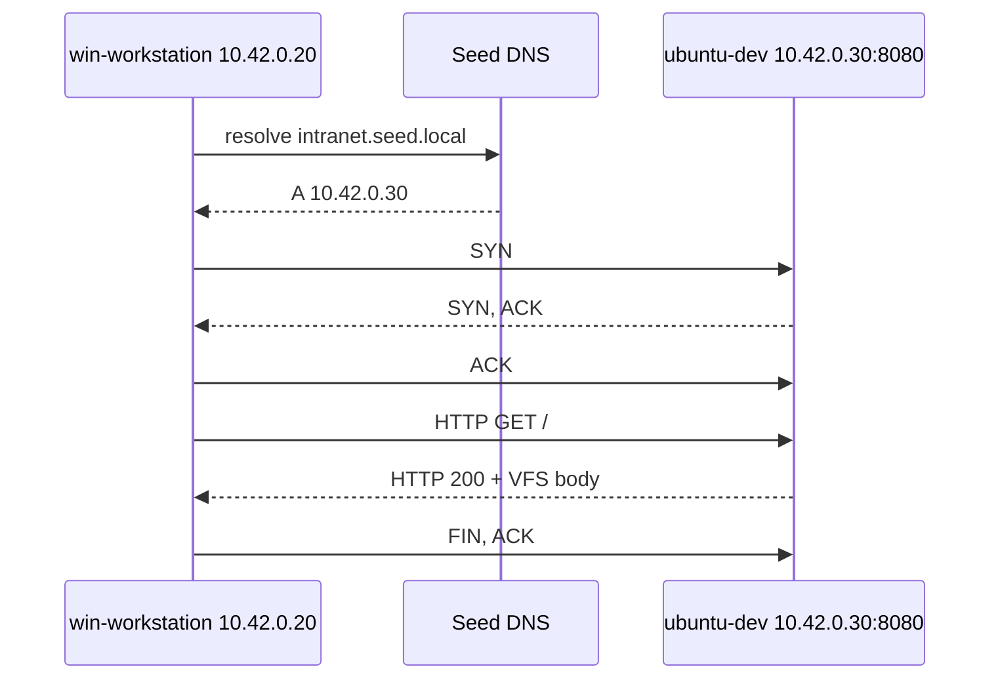
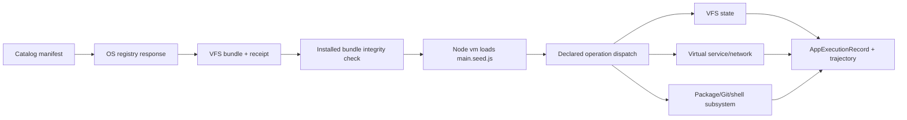

# Seed computer ecosystem: technical report

**System:** Seed Computer Ecosystem 0.3.0

**Reference ecosystem:** `@seed/ecosystem-seed-2026`

**Audience:** researchers building and evaluating computer-interaction agents

**Status:** release implementation and evidence report

## Abstract

Seed is a browser-rendered, server-authoritative computer ecosystem for collecting computer-interaction trajectories. A single Node.js simulation process owns the state of multiple typed computers, their virtual disks, processes, installed applications, package databases, repositories, network services, and collaboration systems. Real browser pages render macOS, Windows 11, and Ubuntu/GNOME displays and send typed operations to that process over HTTP and WebSocket. Headless computers use the same `ComputerSpec` and kernel subsystems without allocating a display page.

The reference ecosystem contains three displayed workstations and one headless service node on a private virtual network. Applications are catalog packages installed as files in each computer's VFS. Non-system applications execute JavaScript loaded from those VFS packages inside a restricted Node `vm` context; system components use explicit kernel adapters. The virtual internet provides A-record DNS, listeners, sockets, causal TCP/HTTP trace semantics, computer-hosted services, and policy-gated real HTTP(S) egress. Slack and Microsoft Teams are deliberately independent service planes with separate hosts, stores, revisions, APIs, and client polling.

The system is designed for causal fidelity: a visible action is credible only when the corresponding authoritative subsystem, persistent or shared state, snapshot, and trajectory evidence agree. It does **not** claim CPU emulation, native Mach-O/PE/ELF execution, native vendor applications, complete shell languages, or RFC-complete networking. Those distinctions are part of the research contract rather than footnotes.

## 1. Fidelity claim and non-claim

The phrase “real browser execution” has a precise meaning here:

1. React application code, DOM layout, CSS, pointer events, keyboard events, focus, window drag/resize/maximize behavior, browser timers, and WebSocket updates execute in a real Chromium browser.
2. The simulator server is real Node.js code. It performs host filesystem persistence for VFS blobs, serves HTTP/WebSocket APIs, executes installed Seed application bundles, and may perform a real `fetch` only after gateway authorization.
3. Simulated computer state is not a set of screenshot fixtures. VFS writes, process termination, package operations, Git operations, DNS resolution, service requests, message sends, application installs, and gateway changes mutate shared runtime objects and appear in subsequent snapshots.
4. A displayed macOS, Windows, or Ubuntu computer is not a native operating-system instance. Kernel names, boot services, paths, processes, sockets, and drivers are typed simulation records with implemented domain behavior; they are not native kernels or binaries.

The browser claim also applies to websites opened inside Safari, Edge, Chromium, and Firefox surfaces. Navigation first traverses the virtual DNS/socket/HTTP fabric; Node then promotes that exact response body into a short-lived document URL. Chromium parses and executes the document inside an iframe sandboxed with `allow-scripts` but without `allow-same-origin`, forms, popups, top navigation, or ambient network connections. The acceptance test runs the same seeded page through all four browser products and proves automatic DOM mutation, a click event listener, timer progress, Canvas pixels, exact response delivery, restrictive CSP headers, opaque-origin isolation, and per-computer packet traces.

This yields four useful fidelity layers:

| Layer | Implemented evidence | Explicit boundary |
|---|---|---|
| visual | real browser rendering, OS-specific chrome, product-specific surfaces, pointer/keyboard recordings | not vendor source code or a pixel-identical native compositor |
| interaction | focus, z-order, drag, maximize/restore, forms, launchers, application actions | not every gesture or accessibility API of each native OS |
| semantic | typed VFS, processes, packages, repositories, services, DNS, sockets, messages, application execution | bounded research models, not native syscalls or complete protocols |
| causal | one action links UI, kernel mutation, VFS/service state, snapshot, packet/trajectory record | some transient UI state remains display-local by design |

The acceptance rule is therefore:



A screenshot alone proves only the last box. A high-fidelity demonstration must connect the boxes.

## 2. Repository and build architecture

The repository is a pnpm workspace scheduled by Turborepo. It is organized by authority rather than by file type: shared contracts live below runtime and UI packages; an ecosystem composes OS profiles, applications, computers, services, and policy; deployable applications consume those packages. This prevents a single simulator folder from becoming the owner of every concept.

```text
apps/
  simulator/                 Node HTTP/WebSocket server + React display client
  chatgpt-workspace/         independently deployable supplied ChatGPT workspace
ecosystems/
  seed-2026/                 concrete computers, app sets, services, DNS, gateways
packages/
  protocol/                  serializable cross-layer contracts
  app-sdk/                   application definition and launch helpers
  os-core/                   OS profile schema and validation
  os-macos/                  macOS 26 profile
  os-windows/                Windows 11 26H2 profile
  os-ubuntu/                 Ubuntu 26.04 profile
  catalog/                   system and ecosystem application definitions
  kernel/                    VFS, process, shell, network, software, app runtime
  ui-surfaces/               product-specific UI/interaction contracts
tooling/
  architecture/              dependency-boundary and cycle checks
  evidence/                  typed workflow/evidence suite
tests/
  kernel.integration.test.ts vertical runtime tests
docs/                        architecture, command contract, fidelity and report
scripts/                     capture, UI audit, demos and local Git wrapper
```

### 2.1 Dependency direction



`tooling/architecture/src/check-boundaries.ts` discovers every workspace under `packages`, `apps`, `ecosystems`, and `tooling`, then checks:

- every workspace has an architecture rule;
- every internal dependency is declared with `workspace:*` and is allowed for that layer;
- source imports do not reach undeclared Seed packages;
- relative imports do not escape a package boundary;
- TypeScript workspaces expose both `build` and `typecheck`; and
- the workspace dependency graph has no cycles.

Turborepo schedules `build`, `typecheck`, and test tasks from the workspace graph. TypeScript project builds verify contracts; Turbo supplies dependency-aware execution and caching. The relevant source-of-truth is [`docs/architecture.md`](architecture.md), not a manually maintained bundle diagram.

### 2.2 Workspace authorities

| Workspace | Owns | Must not own |
|---|---|---|
| `@seed/protocol` | serialized computer, inode, process, socket, packet, app, package, Git, service, and trajectory types | runtime behavior or React |
| `@seed/app-sdk` | manifest construction, operation profiles, package/launch helpers | installation or host access |
| `@seed/os-*` | platform profiles, paths, boot-service and peripheral metadata, native manager sets, system-app IDs | concrete computer instances |
| `@seed/catalog` | application definitions, operation surfaces, service contracts | installed state |
| `@seed/kernel` | mutable simulation mechanisms | reference topology or visual styling |
| `@seed/ui-surfaces` | product information architecture, interactions, state-source requirements, platform adapters | runtime storage |
| `@seed/ecosystem-seed-2026` | one concrete, validated world | generic kernel mechanics |
| `@seed/simulator` | server transport and browser projection | redefinition of lower-layer contracts |
| `@seed/tooling-evidence` | validated scenario assertions | runtime state |

This separation is the scaling mechanism for new computer/OS combinations, application distributions, or independent ecosystem seeds. A new ecosystem package can compose the existing kernel and catalog without modifying the reference seed. A new OS profile can be added below ecosystems. A new application can be defined through the SDK and catalog, installed by one or more ecosystem templates, and mapped to a UI surface independently.

## 3. Topology-driven ecosystem initialization

`seed2026Blueprint` is a serializable `SimulationTopology` plus validated OS-profile and evidence metadata. The kernel constructor receives the topology; it does not contain the reference computers as global constants.

### 3.1 Computers

| Computer | Role | OS/profile | Address | Default shell | Displays |
|---|---|---|---|---|---:|
| `mac-studio` | desktop, creative, agent client | macOS 26 | `10.42.0.10` | zsh | 1 |
| `win-workstation` | desktop, enterprise, agent client | Windows 11 26H2 | `10.42.0.20` | PowerShell | 1 |
| `ubuntu-dev` | desktop, developer, server host, agent client | Ubuntu 26.04 | `10.42.0.30` | bash | 1 |
| `seed-registry` | registry, DNS, service node | headless Ubuntu | `10.42.0.2` | bash | 0 |

Each template carries a `ComputerSpec`, roles, system application IDs, and third-party application IDs. `SimulationRuntime.initialize()` creates the VFS, base filesystem, process table, software environment, shell session, application runtime, and installed application set for each template. A display-less service node follows the same path but never needs a browser page.

### 3.2 Declared services

| Service | Origin/address | Host computer | Isolation domain |
|---|---|---|---|
| DNS | `dns.seed.local:53` / `10.42.0.2` | `seed-registry` | `seed-core` |
| macOS app registry | `https://appstore.seed.local` | `seed-registry` | `apple-registry` |
| Windows app registry | `https://store.seed.local` | `seed-registry` | `microsoft-registry` |
| Ubuntu app registry | `https://packages.seed.local` | `seed-registry` | `ubuntu-registry` |
| Slack | `https://slack.seed.local` | `seed-registry` | `slack` |
| Microsoft Teams | `https://teams.seed.local` | `seed-registry` | `teams` |
| Git | `https://git.seed.local` | `seed-registry` | `git` |
| intranet | `http://intranet.seed.local:8080` | `ubuntu-dev` | `ubuntu-dev` |

The blueprint validator rejects duplicate computer IDs, duplicate addresses, unknown or OS-incompatible installed applications, mismatched system-app classification, missing per-OS registries, duplicate service origins, missing host computers, DNS mismatches, Slack/Teams host or isolation-domain collisions, and incomplete application-surface coverage.

### 3.3 OS profiles

An OS profile declares more than wallpaper and colors. It includes kernel family/version labels, init and service-manager identity, desktop shell/window-manager/compositor/display-server metadata, shell paths and startup-file metadata, filesystem roots and native path conventions, native/language package managers, receipt roots, boot-service parentage, peripheral driver metadata, system applications, and executable/library conventions.

Runtime behavior remains explicit. For example, the profiles enumerate detailed boot services while the current process runtime materializes a recognizable bounded daemon set for each computer. Peripheral records currently support product and UI fidelity; they do not yet provide byte-level device emulation or full hot-plug event lifecycles.

## 4. Runtime authority and browser displays

### 4.1 One authoritative Node process

`apps/simulator/src/server/index.ts` creates one `SimulationRuntime`, one Node HTTP server, and one WebSocket server. That process owns all conceptual computers and services. The REST surface provides snapshots, shell execution, file listing, process termination, gateway mutation, app install/uninstall/execute, virtual HTTP navigation, Slack/Teams polling and posting, and trajectory export. Mutating routes broadcast a fresh simulation snapshot to connected displays.

The single-process claim applies to **simulation authority**. Evidence capture launches a real headless Chromium browser through Playwright; Chromium is a separate host process and may use its own internal process model. The capture suite deliberately reuses one browser for the still-image matrix and application portraits, then uses isolated recording contexts for videos. The simulator does not allocate one Node or browser process per virtual computer.



Browser-local state is reserved for transient presentation concerns such as selection, draft text, hover, animation, and window geometry. Files, installed packages, repositories, process state, gateway policy, collaboration messages, network traces, and application execution records belong to the runtime.

### 4.2 Display model and scaling

Display definitions include physical label, pixel dimensions, and scale. A query selects a computer and an application scene; no terminal or other application is forced open. More displays can be declared per computer because display identity is separate from computer identity.

Memory cost separates into two regimes:

- kernel cost grows with typed records, VFS metadata, application state, packet history, and trajectory history;
- rendering cost grows with the number of simultaneously observed Chromium pages and their DOM/application surfaces.

The evidence scripts exploit that distinction by keeping many computers headless and opening pages only for the pixels under observation. This is materially lighter than launching a VM, native OS, or Chromium instance per simulated computer, while preserving real browser execution for collected visual trajectories.

## 5. Virtual filesystem and disk persistence

Every computer owns one `VirtualFileSystem`. It canonicalizes slash and Windows drive syntax into a shared internal path form. A versioned `file-table.json` maps canonical VFS paths to UUID inode IDs and maps those IDs to inode metadata. File bytes are stored separately in the requested disk directory:

```text
.state/<run-id>/<computer>/file-table.json
.state/<run-id>/<computer>/<disk-id>/<inode-id>
```

For example:



Implemented VFS behavior includes recursive directory creation, UTF-8 file read/write, canonical `.`/`..` resolution, one-level directory listing, recursive removal, inode metadata and stable IDs across writes, usage digests, and blob presence/size verification. File-table persistence writes a temporary JSON file and renames it into place. Integration tests follow exact bytes from shell redirection through canonical path and inode lookup to the corresponding host blob.

The VFS is also the application/package substrate. An installed application receives:

- an OS-native install path;
- `manifest.json`, `package.seed.json`, and its runtime entry file;
- an OS-specific registration artifact (`Info.plist`, `.exe.seed.json`, or `.desktop`);
- a registry receipt in the platform receipt root; and
- a separate per-user data directory.

Uninstall removes the application bundle and receipt while preserving its user data directory. This mirrors a useful desktop lifecycle distinction and is covered by an integration test.

Current VFS non-claims include native APFS/NTFS/ext4 behavior, ACL enforcement, ownership, journaling, quotas, hard links, executable permissions, mmap, file watchers, binary-safe read APIs beyond stored bytes, and full OS-specific case-folding. The protocol has a symlink inode shape, but the current VFS does not expose symlink creation or resolution.

## 6. Process and peripheral model

Each computer owns an independent `ProcessManager` with PID, PPID, executable, argv, cwd, environment, state, start time, modeled CPU time, modeled memory, and listening-port fields. PID 1 is protected. Shell commands and application operations create transient process records; long-lived services create persistent records. The server-authoritative termination path removes the process and unregisters network services owned by that PID so the relevant listeners close.

The initial process set is recognizable by platform:

- macOS: `launchd`, `kernel_task`, `WindowServer`, `loginwindow`, `cfprefsd`, `mDNSResponder`, Finder;
- Windows: `System`, `smss.exe`, `csrss.exe`, `wininit.exe`, `services.exe`, `lsass.exe`, `dwm.exe`, `explorer.exe`;
- Ubuntu: `systemd`, journaling/network services, NetworkManager, GDM, GNOME Shell, PipeWire.

CPU time and memory are simulation counters, not host resource attribution. There is no native scheduler, syscall table, address space, signals beyond modeled termination, IPC fabric, or executable loader. Process-table fidelity is intended for desktop administration tasks and trajectory causality, not operating-systems research that requires instruction execution.

OS profiles also declare display, keyboard, pointer, camera, microphone, speaker, storage, and network devices with role-appropriate driver labels. UI surfaces can depend on `peripherals`, and recordings exercise pointer/keyboard paths in Chromium. Dynamic device enumeration, media frames, block I/O, USB protocols, and complete hot-plug behavior are not implemented.

## 7. Shell interpreters and command coverage

The displayed sessions are labeled zsh, PowerShell, and bash and use OS-appropriate prompts and path formatting. They share one deterministic `ShellSession` tokenizer and dispatcher over typed kernel objects. This design gives cross-platform equivalence for agent tasks while preserving familiar aliases, but it is not three vendor parsers.

The complete audited contract, including every accepted spelling, exact parsing behavior, Git subcommands, package-manager verb normalization, and explicit unsupported commands, is maintained in [`docs/command-coverage.md`](command-coverage.md). It is deliberately more precise than a marketing command list.

At a glance, the implemented families are:

| Domain | Representative accepted forms |
|---|---|
| navigation/files | `pwd`, `Get-Location`, `cd`, `Set-Location`, `ls`, `dir`, `Get-ChildItem`, `cat`, `Get-Content`, `mkdir`, `New-Item`, `rm`, `Remove-Item` |
| composition | quotes, `;`, `&&`, text pipelines, overwrite redirection `>`, limited `$NAME` expansion |
| text | `echo`, `Write-Output`, `grep`, `findstr`, `Select-String`, `wc`, `Measure-Object` |
| processes/system | `ps`, `tasklist`, `Get-Process`, `kill`, `taskkill`, `Stop-Process`, `hostname`, `whoami`, `uname`, `ver` |
| network | `ifconfig`, `ipconfig`, `ip addr`, `ping`, `nslookup`, `dig`, `Resolve-DnsName`, `curl`, `wget`, `iwr`, `netstat`, `ss` |
| ecosystem | `serve`, `apps`, `store`, `gateway`, `git`, and supported package-manager commands |

Important parser boundaries include textual splitting of composition operators, non-streaming string pipelines, one overwrite redirection form, no general variable language, no command substitution/globbing/functions/jobs/scripts, no VFS executable lookup, and case-insensitive aliases on every OS. Unknown commands do not fall through to the host. These limitations keep trajectories deterministic and prevent an apparent shell prompt from being mistaken for arbitrary native execution.

## 8. Package managers

`PackageManagerKind` contains 25 manager families:

```text
brew  mas  apt  dpkg  snap  flatpak  winget  choco  scoop
npm  pnpm  yarn  bun  pip  pipx  poetry  uv  cargo  go  gem
composer  dotnet  nuget  vcpkg  conda
```

Platform availability is explicit:

| Platform | Native managers | Language/project managers available in the seed |
|---|---|---|
| macOS | `brew`, `mas` | npm, pnpm, yarn, bun, pip, pipx, Poetry, uv, Cargo, Go, gem, Composer, dotnet, NuGet, vcpkg, Conda |
| Windows | `winget`, Chocolatey, Scoop | npm, pnpm, yarn, bun, pip, pipx, Poetry, uv, Cargo, Go, gem, dotnet, NuGet, vcpkg, Conda |
| Ubuntu | APT, dpkg, snap, Flatpak | npm, pnpm, yarn, bun, pip, pipx, Poetry, uv, Cargo, Go, gem, Composer, dotnet, NuGet, vcpkg, Conda |

Managers normalize vendor-style verbs into deterministic operations for list, search, info, install, remove, index refresh, outdated, and upgrade. Package records include version, manager, scope, install path, source, SHA-256 integrity, direct/transitive dependencies, files, and installation time. Package transactions record operation, targets, timestamps, committed status, and receipt paths.

The implementation creates manager-appropriate VFS effects rather than merely adding a row to a UI. Examples include Homebrew Cellar paths, macOS application bundles, dpkg info records, snap and Flatpak roots, Windows Program Files/Scoop paths, Node `node_modules` layouts, Python environment paths, Cargo/Go/dotnet tools, and project-local Composer/NuGet/vcpkg directories. Project managers update applicable manifests and lockfiles, including `package.json` plus npm/pnpm/Yarn/Bun locks, `pyproject.toml` plus `poetry.lock`, `composer.lock`, `packages.lock.json`, and `vcpkg.json`. A bounded dependency catalog produces transitive records for representative packages.

These are package-manager **models**. They do not invoke host managers, download or execute arbitrary package scripts, solve general dependency constraints, or reproduce every registry and lockfile format. Their purpose is to support inspectable, deterministic install/update/remove trajectories whose UI, shell result, snapshot, receipt, dependency metadata, and VFS paths agree.

## 9. Git and shared repositories

Git is a typed, VFS-backed repository model. Implemented subcommands are documented exhaustively in [`docs/command-coverage.md`](command-coverage.md) and cover the primary workflow:

```text
init  clone  status  add  commit  log  branch  switch  checkout
remote  push  pull  fetch  diff  rev-parse  config
```

Repositories expose root, current branch, HEAD, local branches, remotes, remote refs, staged paths, and commits. Initialization writes `.git/HEAD`, config, refs, an explicit Seed index, and commit object records under `.git/objects`. Commits derive deterministic hashes and tree digests from modeled state. Visual Git clients consume the same repository snapshot as the shell.

`git.seed.local` provides an independent shared remote service over the virtual HTTPS fabric. Push and fetch exchange typed JSON repository snapshots, update remote refs, produce DNS/socket/packet evidence, and detect the modeled non-fast-forward condition. Local worktrees remain per-computer VFS state; cloning a remote commit does not imply that another computer's untracked or working-tree files are shared.

This is not native Git, a byte-compatible smart protocol, a general merge engine, or a complete implementation of packfiles, hooks, attributes, submodules, signing, credentials, or every revision expression. It is sufficient for deterministic source-control trajectories whose repository, VFS metadata, remote state, clients, and packet trace can be cross-checked.

## 10. Virtual internet, DNS, sockets, HTTP, and gateways

`InternetFabric` is shared by all computers in the Node runtime. It owns computer attachments, DNS records, virtual service handlers, socket records, packet traces, and gateway rules.

### 10.1 Virtual routing

Attaching a computer registers short and fully qualified A records. Registering a service adds its host record and a listening socket. An HTTP request:

1. parses the URL and resolves the virtual A record;
2. selects the destination computer and `host:port` service;
3. creates a client socket;
4. records SYN, SYN/ACK, and ACK trace entries;
5. transitions the client socket to `ESTABLISHED`;
6. records the HTTP(S) request and calls the in-memory service handler;
7. updates listener/client byte counters;
8. records the response and FIN; and
9. closes the client socket.



The shell `serve` command can expose a VFS file or directory at a chosen hostname and port. Its default hostname is network-visible (`<hostname>.seed.local`). The initial intranet service demonstrates one computer hosting content that another computer reaches. Terminating a service process through the authoritative runtime removes its service handlers and closes orphaned listener sockets.

Loopback is namespaced by computer. `localhost`, its hosts-style aliases, and `127.0.0.1` bypass shared DNS and gateway routing; two computers may bind the same loopback port to different content; another computer cannot reach that listener through either its own loopback address or the owner's NIC address. Network/wildcard listeners remain peer-visible. The integration contract covers same-computer success, cross-computer denial, NIC-only versus loopback bindings, socket state, and teardown isolation.

DNS currently provides an in-memory A-record map with TTL metadata. The protocol can represent CNAME, but the current resolver does not implement recursive/CNAME behavior, other record types, caching, DNS transport, or zone delegation.

### 10.2 Real-network egress gateway

Real HTTP(S) egress is allow-list based. A request without a virtual destination is denied unless one enabled egress rule matches:

- protocol;
- exact or `*.` wildcard hostname;
- port; and
- when CIDRs are present, **every** current DNS answer must fall within at least one allowed IPv4 CIDR.

Only after that check does Node call `fetch`. Redirects are returned without automatic following, and the request/response receive gateway packet traces. The reference blueprint allows HTTPS documentation access to three named hosts and otherwise relies on the absence of a matching allow rule for default denial. Settings and APIs mutate gateway enablement through the shared kernel, so policy changes are observable by all displays and appear in trajectories.

The CIDR matcher performs binary IPv4 prefix matching for `/0` through `/32`; mixed DNS answers are rejected. Current boundaries include no IPv6 CIDR support, no DNS pin across the subsequent host fetch, no ingress bridge from the host network, no proxy authentication, no bandwidth/rate model, and no TLS certificate or encryption simulation.

### 10.3 Network non-claim

The fabric provides causal TCP/HTTP **semantics and evidence**, not an RFC-complete TCP/IP implementation. It does not simulate sequence numbers, retransmission, congestion control, fragmentation, MTU, routing tables, ARP/NDP, packet loss, TLS records, QUIC, or general UDP applications. Packet rows are typed semantic trace records, not raw packet captures. This distinction should be retained in downstream publications.

## 11. Independent collaboration and service planes

Slack and Microsoft Teams are separate products and separate simulated services:

| Property | Slack | Microsoft Teams |
|---|---|---|
| host | `slack.seed.local` | `teams.seed.local` |
| isolation domain | `slack` | `teams` |
| service instance | independent `CollaborationService` | independent `CollaborationService` |
| workspace/revision | Slack-specific | Teams-specific |
| API operations | Slack list/poll/send | Teams list/poll/send |
| installed clients | macOS, Windows, Ubuntu seed clients | macOS and Windows seed clients |

A client sends to the matching origin, the corresponding service appends a service-tagged message and increments only its revision, another client of the **same product** polls that service, and WebSocket broadcast projects the updated snapshot. The blueprint validator fails if Slack and Teams share a host or isolation domain. The integration suite proves that a Slack message appears in a later Slack poll while the contemporaneous Teams poll remains empty.

There is no Slack↔Teams bridge, shared channel store, or cross-product polling. Any future bridge would be a new explicit service with its own authorization, mapping, persistence, packets, and trajectory events.

The same service-contract mechanism gives cloud-backed applications named backend origins. Generic service adapters hold events in separate per-host in-process stores and route operations through virtual HTTPS; client-side operation summaries are written to each app's VFS state. This establishes an extension seam; it does not imply durable cloud databases or complete vendor APIs.

## 12. Installable application runtime

### 12.1 Definition and installation

Every catalog entry is an `AppManifest` containing product identity, version, publisher, supported OSes, entrypoint, package source, capabilities, file associations, default window size, user-observable operations, service contracts, and runtime descriptor. `defineApplication` validates IDs, entrypoint shape, OS support, duplicate operations, and required service hosts. Operation profiles are entrypoint-specific: files, terminal, browser, chat, editor, Git, packages, process tools, media, design, database, and other categories expose different verbs.

Interactive installation resolves the OS-specific virtual registry, retrieves a package descriptor, writes the bundle and registration files into the target VFS, writes a receipt, rereads the installed entry file, and verifies its SHA-256 hash. Startup installation uses the same package materialization path without generating user-facing network traffic.

### 12.2 VFS JavaScript execution

Third-party applications default to `seed-js`. `SeedApplicationRuntime.execute()`:

1. verifies that the app is installed and the requested operation is declared;
2. spawns a modeled application process;
3. reads `<installPath>/main.seed.js` from that computer's VFS;
4. creates a Node `vm` context without `require`, `process`, host globals, or string/WASM code generation;
5. evaluates the installed module with a short synchronous script timeout;
6. exposes a frozen SDK object containing app identity/capabilities and one scoped `dispatch` function;
7. routes the declared operation to VFS, network, shell, package, Git, collaboration, or app-state behavior;
8. records a typed `AppExecutionRecord`; and
9. terminates the modeled process.



System applications use `system-component` descriptors and explicit dispatcher adapters rather than executing arbitrary system binaries. A `seed-wasm` descriptor exists in the protocol, but execution requires an installed exported run function and is not a general WASM application ABI in this version.

The Node `vm` module is not treated as a hardened hostile-code security boundary. The context reduces ambient access and the dispatch surface is operation-scoped, but the current capability list is not yet a complete object-capability enforcement system and async execution lacks a general wall-clock budget. Seed application packages are trusted simulation inputs. Arbitrary host execution is a separate `HostExecutionGateway`, default-deny unless a rule matches computer, app, resolved executable, working-directory root, timeout, and output limit.

### 12.3 Durable application state

Local application operations persist `state.json` under the app's per-user VFS data path. Service-backed operations persist the returned service result marker locally and mutate only their declared backend service. Browser operations route through `InternetFabric`; editor operations write VFS files; package and Git clients call the same software state machine that shell commands use. The snapshot exposes recent execution records across computers.

This gives an application more substance than a bespoke React mock while keeping the runtime deterministic and inspectable. It is not an ABI for unmodified macOS, Windows, Linux, Electron, or browser extensions.

## 13. Application ecosystem survey

The catalog is split into system applications and independently installable ecosystem applications. Catalog size and installed-instance counts are release metrics rather than constants in this report:

| Metric | Final value |
|---|---|
| catalog manifests | 60 |
| system manifests | 31 |
| ecosystem manifests | 29 |
| installed app instances | 111 at topology boot; 112 after the recorded App Store installation |
| validated UI coverage | 60 application assignments across 46 surface contracts |

### 13.1 System application sets

| macOS seed | Windows seed | Ubuntu/GNOME seed |
|---|---|---|
| Finder | File Explorer | Files (Nautilus) |
| Terminal | Terminal | Terminal |
| System Settings | Settings | Settings |
| TextEdit | Notepad | Text Editor |
| Preview | Photos | Calculator |
| Photos | Calculator | Calendar |
| Calculator | Calendar | Mail |
| Calendar | Microsoft Store | App Center |
| Mail | Microsoft Edge | System Monitor |
| App Store | Paint | Software Updater |
| Safari | Snipping Tool | Document Viewer |
| Messages | Task Manager | Rhythmbox |
| FaceTime | Outlook |  |
| Music |  |  |
| Maps |  |  |
| Reminders |  |  |

### 13.2 Ecosystem applications

| Domain | Applications represented |
|---|---|
| browsers/network | Chromium, Firefox, Wireshark, Postman |
| collaboration/meetings | Slack, Microsoft Teams, Discord, Zoom Workplace |
| agent workspace | ChatGPT desktop client on macOS, based on the supplied `chatgpt-workspace-clone` source |
| code/development | Visual Studio Code, Cursor, Docker Desktop, DBeaver |
| source control/software | GitHub Desktop, GitKraken, Package Center |
| planning/knowledge | Notion, Linear, Obsidian |
| design/creative | Figma, GIMP, Blender |
| documents/media | LibreOffice, Audacity, Spotify, VLC |
| library/security | Steam, Bitwarden, 1Password |

Supported-OS metadata and the reference ecosystem's installed sets are separate. For example, an app can support all three platforms but be installed by default on only one reference computer. App-store workflows can materialize a compatible catalog app later without modifying the OS package.

`@seed/ui-surfaces` assigns every catalog application to exactly one product surface contract. Each contract names layout, information regions, interactions, authoritative state sources, platform adapters, and an identity rule. This blocks the common failure mode in which unrelated applications share one generic dashboard merely because they both contain lists. Finder/File Explorer/Nautilus, Slack/Teams/Discord, VS Code/Cursor, GitHub Desktop/GitKraken, Apple Music/Rhythmbox/Spotify/VLC, and Paint/GIMP/Figma/Blender have deliberately different information architectures.

Surface coverage validation proves that every catalog ID has one compatible mapping; it does not by itself prove that every declared interaction is behaviorally complete. Behavioral acceptance requires runtime execution records, state changes, and evidence capture.

### 13.3 ChatGPT workspace

The supplied `chatgpt-workspace-clone-v0.3.0` source remains an independently deployable application under `apps/chatgpt-workspace`. It contains its own Next.js routes, workspace/session/data modules, and product UI. The seed catalog also defines a macOS desktop adapter with Chat and Work modes, a custom integrated title region, project/work context, file/network capabilities, and a named `chatgpt.seed.local` service contract.

The preserved application and the simulator surface are related but not collapsed into the kernel. This keeps the uploaded application maintainable as a normal app workspace while allowing its desktop operations to participate in VFS, network, app-execution, and trajectory evidence.

## 14. UI and UX fidelity acceptance

Visual fidelity is evaluated at three levels.

### 14.1 Platform chrome

The three shells implement different global navigation and window conventions rather than recoloring one template:

- macOS uses a menu bar, active-application identity, Dock/Launchpad model, traffic-light controls, and macOS window treatment;
- Windows uses Start/taskbar organization, 32 px title bars, 16 px title icons, and three 46 × 32 px caption targets;
- Ubuntu uses GNOME top-bar/Activities organization, dock behavior, header-bar conventions, and GNOME window controls.

The acceptance source is [`docs/fidelity-acceptance-spec.md`](fidelity-acceptance-spec.md), with calibration notes in [`docs/calibration-notes.md`](calibration-notes.md). Reference mock-OS repositories are treated as implementation studies, not normative specifications. Platform human-interface guidance and direct visual inspection take precedence when a reference demo is outdated or behaviorally incorrect.

### 14.2 Product identity

Applications must preserve role-model information architecture, vocabulary, hierarchy, and control placement. Recognizable icons are code-native assets selected by product ID from local icon packs or repository SVGs. Brand marks remain the property of their owners; the project does not claim vendor code or endorsement.

A dedicated audit searches for rogue elements and systematic defects: oversized or missing title icons, wrong title-bar/caption geometry, content overflow, windows outside the work area, generic fallback surfaces, and incorrect active-application labels. The output is `artifacts/ui-audit-v3.json` and the audit exits nonzero on geometric errors.

### 14.3 Functional UX

High fidelity requires meaningful controls to call the application/kernel API and leave causal state. Examples include:

- Save writes through the installed editor operation into the VFS and becomes visible to a file manager;
- app-store install resolves the registry, verifies the bundle, writes a receipt, and updates the launcher on another display;
- process termination mutates the process table and removes service listeners;
- gateway toggles change the shared policy used by subsequent network requests;
- Slack clients communicate only through Slack, and Teams clients only through Teams;
- browser navigation creates DNS, socket, HTTP, and packet evidence;
- package and Git clients render the same typed records produced by shell/API actions.

Controls that only change transient presentation state should be labeled and tested as such. A decorative control is not counted as functional evidence.

## 15. Evidence methodology

The evidence suite is generated, not hand-assembled. `@seed/tooling-evidence` defines typed scenes with computer ID, applications, workflow label, and a causal assertion. Validation checks unique IDs, computer existence, OS compatibility, default installation, and the expected reference-suite shape before capture.

### 15.1 Static breadth evidence

`scripts/capture-evidence.ts` launches the simulator with a deterministic run ID and uses a real headless Chromium browser. It captures:

- workflow states spanning all three displayed computers, usually with two or three simultaneously active applications and no terminal requirement;
- larger per-OS workflow plates for legible review rather than relying only on one dense contact sheet;
- one portrait for each installed catalog application on a compatible representative OS;
- application portrait plates and a machine-readable portrait index; and
- full launcher/icon walls for macOS, Windows, and Ubuntu.

Expected artifact roots:

| Evidence | Path |
|---|---|
| individual workflow states | `artifacts/evidence-v3/48-states/` |
| overview contact sheet | `artifacts/evidence-v3/48-desktop-states-grid.png` |
| legible OS workflow plates | `artifacts/evidence-v3/workflow-plates/` |
| individual app portraits | `artifacts/evidence-v3/app-portraits/` |
| app portrait plates | `artifacts/evidence-v3/app-portrait-plates/` |
| portrait manifest | `artifacts/evidence-v3/app-portrait-index.json` |
| launcher/icon walls | `artifacts/evidence-v3/icon-walls/` |

The directory name `48-states` reflects the validated reference suite; the methodology is not restricted to 48 scenes. Future ecosystems can define as many workflows and larger plates as required for legibility.

### 15.2 Motion and causal evidence

Recordings use Playwright's real pointer/keyboard APIs. A semi-transparent event bar names mouse movement, pointer down/up, keyboard input, API action, and observed state transition; a cursor overlay makes motion legible. Paired recordings place both computers in one frame when immediacy across clients is the claim.

| Recording | Causal assertion | Artifact |
|---|---|---|
| Slack cross-device | a Slack send on macOS reaches Slack on Ubuntu through the Slack service | `artifacts/evidence-v3/recordings/slack-cross-device-live.mp4` |
| Teams cross-device | a Teams post on Windows reaches Teams on macOS through the Teams service | `artifacts/evidence-v3/recordings/teams-cross-device-live.mp4` |
| cross-host network | Windows Chromium reaches Ubuntu's VFS-hosted intranet while Wireshark updates | `artifacts/evidence-v3/recordings/windows-to-ubuntu-network-live.mp4` |
| window management | Windows title-bar drag, maximize, and restore change real DOM window geometry | `artifacts/evidence-v3/recordings/windows-window-management.mp4` |
| packages and Git | APT receipt and Git commit appear in Package Center/GitKraken from shared state | `artifacts/evidence-v3/recordings/package-manager-and-git.mp4` |
| VFS save/observe | Notepad save writes the VFS and File Explorer observes the file | `artifacts/evidence-v3/recordings/vfs-file-save-and-observe.mp4` |
| application install | App Store registry install creates a VFS bundle/receipt and updates the launcher | `artifacts/evidence-v3/recordings/app-store-install-live.mp4` |

Each MP4 also receives a poster PNG. Raw Playwright recordings are retained under `artifacts/evidence-v3/recordings/raw/` during generation and can be excluded from a compact release if the final MP4s and provenance are preserved.

### 15.3 Programmatic UI audit

`scripts/audit-ui.ts` opens every installed application on every displayed computer in Chromium and measures the rendered DOM. It fails on missing geometry, document or content horizontal overflow, windows outside the work area, and Windows title/caption violations. It warns on generic fallback surfaces and active-application label mismatches.

### 15.4 Vertical integration evidence

The kernel suite tests complete causal paths, including:

- topology boot and DNS;
- cross-computer HTTP plus packet evidence;
- shell redirection → VFS path table → inode blob;
- zsh/PowerShell/bash spellings over shared kernel state;
- native and language package installs;
- package dependencies, lockfiles, receipts, and transactions;
- Git objects and shared remote push/fetch without shared worktrees;
- independent Slack and Teams state;
- installed VFS JavaScript bundle execution;
- cloud-backed app operations and local app state;
- default-deny host execution and preserved app data on uninstall;
- process and gateway mutation; and
- IPv4 CIDR enforcement against every resolved address.

The release validation and capture produced these measured results:

| Validation metric | Final value |
|---|---|
| architecture workspaces / internal edges | 14 / 30; boundary graph valid |
| strict typecheck | 14 / 14 workspaces passed |
| production build | 14 / 14 workspaces passed with Turbo cache bypassed |
| integration tests | 15 / 15 passed |
| browser document tests | 4 / 4 product surfaces passed: Chromium, Edge, Safari, Firefox |
| UI audit inspected / errors / warnings | 111 / 0 / 0 |
| workflow scenes / plates | 48 / 6 |
| app portraits / portrait plates | 60 / 10 |
| motion recordings | 7 |
| production JS/CSS before gzip | 468.95 kB JavaScript / 118.97 kB CSS |
| release archive size | approximately 76.6 MB as a compact ZIP; the build emits exact bytes and a SHA-256 sidecar <!-- METRIC:release_archive_size --> |

## 16. Trajectory schema and reproducibility

`TrajectoryRecorder` assigns a monotonic sequence, timestamp, run ID, optional computer/display, actor, kind, action, target, data, and optional state hash. Events distinguish pointer, keyboard, window, process, filesystem, network, app, and snapshot activity. `GET /api/trajectory` exports newline-delimited JSON.

The snapshot contains topology identity, computers, process/socket/package/repository state, DNS, packet history, gateway policy, application catalog, collaboration snapshots, application execution records, host-execution rules, and trajectory length. This is the machine-readable companion to pixel evidence.

Reproduction commands:

```bash
pnpm check:boundaries
pnpm typecheck
pnpm test
pnpm test:browser
pnpm exec turbo run build --force
pnpm audit:ui
pnpm capture:evidence
pnpm manifest:evidence
```

The simulator defaults to `.state/run-<timestamp>` and capture supplies deterministic run IDs. The delivered repository history can be inspected with ordinary `git log` against the checkout.

Exact wall-clock timestamps, UUIDs, and host-rendered font rasterization are not currently deterministic across independent runs. The system supports deterministic topology and scripted action order; it does not yet claim byte-identical replay or virtual time.

## 17. Security and trust boundaries

The design separates three trust decisions:

1. **virtual application operations:** allowed only when declared in the installed manifest; they receive a narrow dispatch object rather than ambient host globals;
2. **real network access:** allowed only when an enabled gateway rule matches protocol, hostname, port, and optional resolved-address CIDRs; and
3. **host process execution:** denied by default and, when configured, constrained by computer/app IDs, exact resolved executables, working-directory roots, timeout, and output cap.

All three are observable in execution or trajectory records. However, Node `vm` is not a hardened adversarial sandbox, the VFS is not a security boundary against the simulator process itself, and generic service handlers trust their seed inputs. The intended threat model is controlled trajectory generation with trusted ecosystem definitions, not multi-tenant execution of hostile third-party packages.

## 18. Fidelity boundary matrix

| Implemented and testable | Not claimed |
|---|---|
| real Chromium execution for desktop/application UX and sandboxed virtual-site JavaScript | native OS sessions, vendor application binaries, or an unrestricted browser security model |
| one Node authority for multiple typed computers/services | CPU/MMU/device emulation or native syscalls |
| inode table plus host blobs under the required state layout | native filesystem semantics, ACLs, journaling, mmap, hard links |
| modeled processes, boot daemons, listeners, termination | native scheduling, address spaces, signals, IPC, executable loading |
| deterministic shared shell subset with familiar aliases | complete zsh, bash, PowerShell, or cmd grammar |
| 25 package-manager models with receipts/dependencies/locks | arbitrary registry resolution, lifecycle scripts, or native packages |
| VFS-backed Git objects/refs and shared typed remote | byte-compatible Git protocol, packfiles, merges, hooks, signing |
| A-record DNS, services, sockets, HTTP and TCP trace semantics | RFC-complete DNS/TCP/IP/TLS/QUIC and raw packet capture |
| IPv4 CIDR/host/protocol/port egress authorization | IPv6 gateway policy, DNS pinning through host fetch, general ingress |
| VFS-loaded Seed JavaScript app execution | unmodified Electron/native apps or a hardened hostile-code sandbox |
| isolated Slack and Teams service planes | a cross-product bridge or complete vendor cloud APIs |
| product-specific UI contracts and DOM geometry audit | verified pixel identity for every control/state of every product |
| scripted stills, paired videos, UI audit, vertical tests | proof of untested workflows or every declared UI interaction |

## 19. Extension procedure

### Add a computer or ecosystem

Create or extend an ecosystem package with `SimulationComputerTemplate`, service, gateway, and installed-app declarations. Validate IDs, addresses, service origins, registries, app compatibility, and UI surface coverage before constructing the runtime. No kernel edit is required for another instance of an existing OS profile.

### Add an OS profile

Create a package depending on `@seed/os-core` and `@seed/protocol`; define paths, shell metadata, services, peripherals, package managers, system app IDs, and conventions; then add it to an ecosystem. Runtime-specific daemon or path behavior must be implemented explicitly rather than implied by a visual theme.

### Add an application

Define the manifest through `@seed/app-sdk`, declare supported OSes, entrypoint, operations, capabilities, and backend contracts, add one product-specific surface assignment, and include it in an ecosystem or registry. Test package materialization, entry-file integrity, operation dispatch, VFS/service state, and at least one real-browser workflow.

### Add a service or gateway

Declare the service in the topology with a unique origin, host computer, kind, and isolation domain, then register a typed handler in the runtime. Gateways should remain explicit allow rules; CIDR-constrained rules require resolved-address tests, including mixed-answer rejection.

## 20. Conclusion

Seed occupies a deliberate point between a screenshot mock and a native virtual machine. It uses real browser execution and real Node-side application code, while replacing expensive native OS instances with typed, inspectable, deterministic computer semantics. The serious monorepo separation—contracts, SDK, OS profiles, catalog, kernel, surfaces, ecosystem, applications, and evidence—makes that point scalable rather than monolithic.

The strongest evidence is cross-layer agreement: a user manipulates a real browser window; the correct app operation reaches the correct computer; the intended VFS, process, package, Git, network, or isolated service state changes; another view observes that same state; and the trajectory records the causal chain. The report's explicit boundaries ensure those demonstrated properties are not inflated into claims of native execution or protocol completeness.
