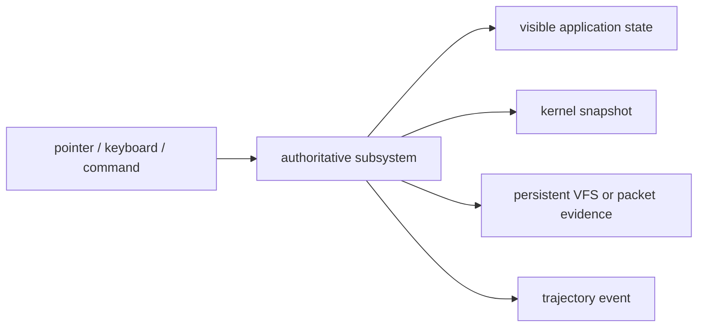
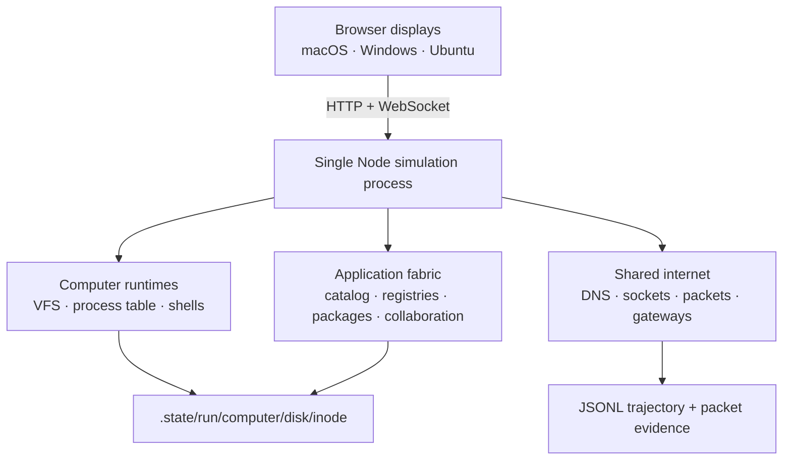
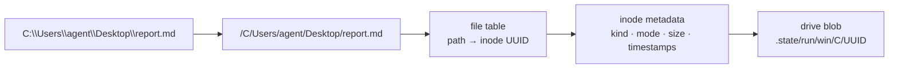
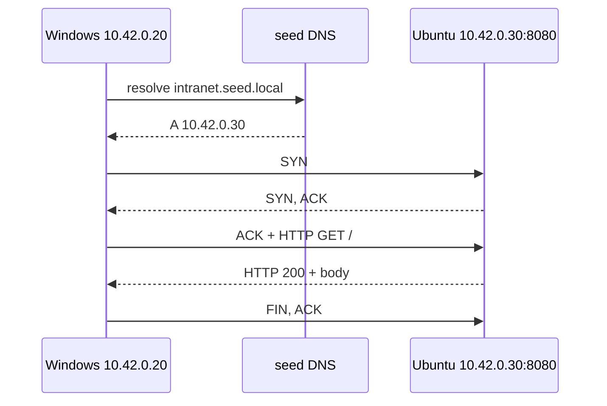

# seed computer ecosystem: technical report

**Version:** 0.2.0 evidence release  
**Purpose:** a lightweight, deterministic, agent-facing computer environment in which pixels, files, processes, packages, repositories, messages, network operations, and trajectory evidence agree.

## executive result

This repository is a runnable TypeScript monorepo. One Node process owns three display computers (`mac-studio`, `win-workstation`, and `ubuntu-dev`) plus a headless registry/service node. Browser displays project that authoritative state as macOS, Windows 11, and Ubuntu/GNOME experiences. The process owns persistent inode-backed disks, typed process tables, stateful zsh/PowerShell/bash interpreters, 20 package-manager families, VFS-backed Git, DNS, virtual TCP/HTTP services, cross-device collaboration, app registries, gateway policy, and JSONL trajectory export.

The catalog contains **60 typed application manifests**. The evidence set contains **48 independent non-terminal desktop states**, **four scripted motion recordings**, and paired cross-computer demonstrations. The current production client is approximately **388 KB JavaScript and 48 KB CSS before gzip**; strict type-checking, production build, and **6/6 integration tests pass**.

The word *simulator* matters. This release implements coherent domain semantics and real simulator side effects; it does not claim host-native Mach-O/PE/ELF execution, complete shell grammars, RFC-complete TCP/TLS, or an arbitrary vendor application ABI.


## fidelity contract

Visual similarity alone is not accepted as proof. A user action must leave consistent evidence at each layer it touches.



Examples:

| Action | Required agreement |
|---|---|
| write a file | shell result, canonical path, inode metadata, and exact host blob agree |
| install a package | package snapshot, manager database, VFS receipt, and visible Package Center row agree |
| commit a repository | working tree, index, object record, ref/HEAD, Git client, and shell log agree |
| send a message | sender attribution, shared service state, macOS Slack, Windows Teams, and trajectory event agree |
| open a cross-host URL | DNS record, socket state, TCP/HTTP packet trace, browser response, and Wireshark row agree |
| move a window | pointer event, focus/z-order, geometry, visible frame, and trajectory record agree |

## architecture



The browser keeps display-local window geometry, but not filesystem, package, repository, process, network, or collaboration truth. That truth lives in `SimulationRuntime` and is streamed to displays as snapshots. A headless service node uses the same `ComputerSpec` and subsystem types as a workstation; it simply declares zero displays.

### monorepo packages

| Package | Responsibility | Important types/services |
|---|---|---|
| `@seed/protocol` | contracts shared by server, kernel, apps, and client | computer, inode, process, socket, packet, package, Git repository, collaboration, app manifest, trajectory types |
| `@seed/kernel` | state mutation and persistence | `SimulationRuntime`, `VirtualFileSystem`, `ProcessManager`, `ShellSession`, `InternetFabric`, `SoftwareEnvironment`, `TrajectoryRecorder` |
| `@seed/catalog` | OS-independent application definitions | 60 system and ecosystem manifests |
| `@seed/simulator` | one-process API/event server and browser projection | HTTP routes, WebSocket snapshots, window manager, OS chrome, application adapters |
| `apps/chatgpt-workspace` | supplied full-stack ChatGPT workspace source | preserved v0.3.0 source plus desktop adapter |

## computer topology

| ID | Role | OS shape | IPv4 | Shell | Displays |
|---|---|---|---|---|---:|
| `mac-studio` | workstation | macOS | `10.42.0.10` | zsh | 1 |
| `win-workstation` | workstation | Windows | `10.42.0.20` | PowerShell | 1 |
| `ubuntu-dev` | development + intranet host | Ubuntu | `10.42.0.30` | bash | 1 |
| `seed-registry` | registry, Git, and shared services | headless Ubuntu | `10.42.0.2` | bash | 0 |

Additional computers and displays can be declared with the same type system. Kernel cost follows simulated state; browser cost follows observed pixels. Headless computers do not require a browser page.

## virtual filesystem and persistence

The VFS canonicalizes POSIX and Windows paths into one namespace while preserving OS-native display syntax. Directories and files receive stable UUID inodes. A file table maps canonical paths to inode IDs; content bytes live in opaque blobs under the requested drive layout:

```text
.state/<run-id>/<computer>/<disk>/<inode-id>
```



Writes update content and metadata before atomically replacing the file table. `verifyContent()` checks blob presence and size. Integration tests follow exact bytes from shell redirection through the canonical path and inode table to the host blob.

Installed applications and packages are files too. Application installs write `manifest.json` and `entrypoint.seed` under OS-native locations:

- macOS: `/Applications/<name>.app/`
- Windows: `/C/Program Files/<name>/`
- Ubuntu: `/opt/<id>/`

Package-manager databases and receipts use manager-appropriate paths in the virtual disk. Git writes `.git/HEAD`, config, refs, index state, and object records to the same VFS.

## process and shell model

Boot creates PID 1 plus recognizable services such as `launchd`/`WindowServer`, Windows session and desktop services, or `systemd`/GNOME/NetworkManager. Processes carry PID, PPID, argv, cwd, environment, state, CPU time, memory, and listening-port fields.

The sandboxed interpreter is stateful and composable. It cannot escape into the host container. Bash/zsh and PowerShell vocabulary maps onto the same typed kernel objects.

### command coverage

| Area | Bash/zsh forms | PowerShell/Windows forms |
|---|---|---|
| location | `pwd`, `cd` | `Get-Location`, `Set-Location` |
| listing | `ls` | `dir`, `Get-ChildItem` |
| read/write | `cat`, `echo`, `touch` | `type`, `Get-Content`, `Write-Output`, `New-Item` |
| directories/delete | `mkdir`, `rm` | `md`, `del`, `Remove-Item` |
| processes | `ps`, `kill` | `tasklist`, `Get-Process`, `taskkill`, `Stop-Process` |
| identity/system | `hostname`, `whoami`, `uname` | `hostname`, `whoami`, `ver` |
| state/history | `history`, `env`, `date`, `clear` | `Get-History`, `set`, `Get-Date`, `cls` |
| interfaces | `ifconfig`, `ip addr` | `ipconfig` |
| DNS | `nslookup`, `dig` | `Resolve-DnsName` |
| HTTP | `curl`, `wget` | `iwr` |
| sockets | `netstat`, `ss` | `Get-NetTCPConnection` |
| services | `serve <port> <path> [hostname]` | same simulator command |
| app ecosystem | `apps`, `store install` | same simulator commands |

Composition includes `;`, `&&`, pipelines, `>` redirection, single/double quotes, cwd/home expansion, and environment variables. This is a broad research subset, not complete POSIX, zsh, bash, or PowerShell grammar compatibility.

## package managers

`SoftwareEnvironment` provides deterministic `search`, `list`, `info`, `install`, `remove`, and `update` behavior. The manager name, package version, scope, source, files, and install time enter the computer snapshot; manager databases and receipts enter the VFS.

| Platform scope | Implemented families |
|---|---|
| macOS native | `brew` |
| Windows native | `winget`, `choco`, `scoop` |
| Ubuntu native | `apt`, `snap`, `flatpak` |
| language/project | `npm`, `pnpm`, `yarn`, `pip`, `pipx`, `uv`, `cargo`, `go`, `gem`, `composer`, `dotnet`, `conda` |

The implementation never invokes the host package manager. It models predictable package semantics inside the simulated computer and makes the resulting disk state inspectable.

## Git

The Git command surface includes:

```text
init clone status add commit log branch switch checkout remote
push pull fetch diff rev-parse config
```

Repositories expose working-tree status, branches, current HEAD, remotes, and commit history. GitHub Desktop and GitKraken render those same repository snapshots. A virtual Git service is registered as `git.seed.local:9418` for remote-oriented workflows.

The object model is intentionally bounded. It persists repository objects and refs sufficient for deterministic development trajectories; it is not a byte-compatible replacement for every Git transport, packfile, hook, or merge edge case.

## internet fabric, DNS, TCP semantics, and gateways

The fabric owns A records, service listeners, client sockets, packet traces, and gateway rules. Services can bind localhost-only or network-visible ports. A virtual HTTP request emits DNS state, a TCP handshake, an application request/response, and close semantics while updating socket byte counters.



Real-internet egress is default-deny. A rule must match protocol, hostname/wildcard, and port before the runtime calls its real-fetch adapter. Redirects are returned without being followed. Allowed requests are audited in the packet trace. Gateway types include CIDR fields; binary CIDR matching and resolved-IP pinning remain explicit next work.


## cross-device collaboration

Slack, Teams, and the seed collaboration service share typed message records. A send action records actor and source computer, mutates the shared service state, broadcasts a WebSocket snapshot, updates both application surfaces, and creates a trajectory event. The paired recording keeps macOS and Windows visible simultaneously so send and receive can be observed in one frame.


## application ecosystem

Every application is an `AppManifest` with ID, version, publisher, supported OSes, entrypoint, package path, default window size, file associations, and declared capabilities. The 60-manifest catalog covers:

- OS starter apps: file managers, settings, editors, stores, mail, calendar, calculators, media, process tools, and platform utilities;
- communication: Slack, Teams, Discord, Zoom, Messages, FaceTime, Mail, and Outlook;
- browsers/network: Safari, Edge, Chromium, Firefox, Wireshark, and Postman;
- development: VS Code, Cursor, GitHub Desktop, GitKraken, Docker Desktop, Postman, Wireshark, and DBeaver;
- creative/document/media: Figma, Notion, Linear, Obsidian, LibreOffice, Paint, GIMP, Blender, Audacity, Spotify, VLC, Steam, and others;
- security: Bitwarden and 1Password.

The official App Store is backed by a virtual registry service at `appstore.seed.local` on the headless service node. Installation fetches and validates a manifest before writing the package into the destination VFS.

Brand-role icons are selected at build time from locally bundled Iconify Logos, Simple Icons, Fluent Color, and Material icon sources. They were compared with official role-model guidance where available, including Slack’s media kit and OpenAI’s brand guidance. Product names and marks belong to their owners. The simulator aims for recognizable, native-looking roles but does not claim vendor source code or pixel-perfect identity for every application surface.


## supplied ChatGPT workspace

The uploaded `chatgpt-workspace-clone` v0.3.0 source remains under `apps/chatgpt-workspace`. The desktop adapter keeps one simulation process while preserving Chat/Work modes, project navigation, model/effort controls, run state, artifacts, and inspector context. Its macOS window now uses a custom translucent title bar with integrated traffic controls and application identity.


## trajectory capture and headless operation

Every recorded event has a monotonically increasing sequence, timestamp, run ID, optional computer/display, actor, kind, action, target, data, and optional state hash. `GET /api/trajectory` exports JSONL.

The evidence runner uses one sandbox-compatible Chromium process. It renders independent pages/frames for observed displays while all computer state remains in Node memory. It captured:

- an 8×6 grid of 48 states—16 per OS—with no terminal window;
- Windows File Explorer + Task Manager drag/focus/maximize/restore;
- macOS Slack sending to Windows Teams;
- Windows Chromium reaching an Ubuntu-hosted service while Wireshark updates;
- Ubuntu Package Center and GitKraken reflecting an APT install and Git commit.

Recordings include semi-transparent input-event bars and cursor/keyboard annotations. Animated GIFs are embedded in the presentation; MP4 versions are delivered separately.

## validation evidence

| Contract | Result |
|---|---|
| strict type checking across packages | pass |
| production client build | pass; ~388 KB JS / ~48 KB CSS before gzip |
| default topology and boot services | pass |
| cross-host DNS/TCP/HTTP route and packet trace | pass |
| shell redirection → inode table → host blob | pass |
| dialect aliases across zsh/PowerShell/bash | pass |
| package install/remove/update with VFS receipts | pass |
| Git object persistence and collaboration synchronization | pass |
| integration suite | 6/6 pass |
| rendered evidence | 48 states + 4 motion proofs |

## reference-repository learnings

The UI work retains useful ideas from [JacobFV/macos-web-next](https://github.com/JacobFV/macos-web-next) and [JacobFV/windows-web-next](https://github.com/JacobFV/windows-web-next): componentized OS chrome, recognizable window geometry, and app-specific surfaces. The implementation changes the architecture:

1. files, processes, services, sockets, packages, repositories, messages, and terminal commands meet in one server-authoritative runtime;
2. OS chrome consumes typed manifests rather than hard-coding a closed app list;
3. pixels and agent-facing state derive from the same snapshot;
4. deterministic trajectory evidence is a first-class output;
5. scenes are query-driven, so no application—including Terminal—is forced to remain open.

## fidelity boundary

| Implemented and functional | Not yet claimed |
|---|---|
| inode-backed VFS with corresponding host blobs | full ACLs, journaling, mmap, hard links, real filesystems |
| typed process tables and recognizable boot services | native Mach-O/PE/ELF execution and real syscalls |
| stateful composable shell subset | complete zsh/bash/PowerShell grammars |
| 20 deterministic package-manager families | host package execution or every manager edge case |
| VFS-backed Git repository model | every packfile, hook, merge, and transport behavior |
| DNS, listeners, sockets, TCP/HTTP trace semantics | RFC-complete retransmission, congestion, fragmentation, and TLS |
| exact-host/protocol/port egress policy | resolved-IP pinning and fully enforced binary CIDR matching |
| 60 manifests and substantive role surfaces | arbitrary vendor application code or a universal third-party ABI |
| pointer/keyboard/state/packet/file trajectories | deterministic virtual time and byte-identical replay scheduling |

## recommended next milestones

1. Execute installed `entrypoint.seed` packages in capability-secured QuickJS or WASM workers.
2. Add deterministic virtual time and seeded scheduling so identical action streams reproduce byte-identical state and frames.
3. Add file descriptors, pipes as kernel objects, permissions, mounts, symlinks, and event watchers.
4. Complete CIDR enforcement, resolved-IP pinning, UDP, NAT tables, latency/loss, DNS caching, and TTL expiry.
5. Emit synchronized accessibility, pixel, input, and state frames with content hashes and replay indexes.
6. Profile trajectory-scale workloads before moving hot storage or packet paths to Rust/WASM; keep TypeScript as the control plane unless measurement justifies the split.
